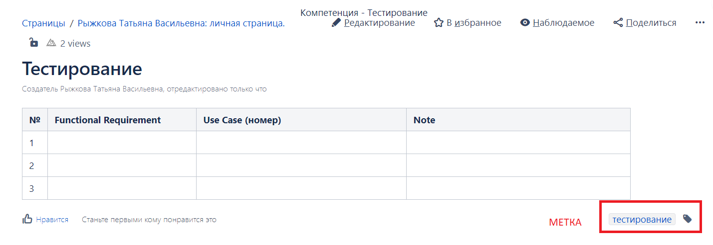

# Проект №2 — Управление тестированием. Аналитика. Тестовая документация

Стратегия и тест-план созданы, организационные вопросы решены.
Самое время приступать к реализации задачи.

Как мы уже выяснили, обеспечение качества — это непрерывный процесс, идущий параллельно с разработкой.

Инженеры по тестированию, ваш выход!

## Contents

1. [Chapter I](#chapter-i) \
    1.1. [Requirement Analysis](#requirement-analysis)
    1.2. [Task 1](#task-notion)
    1.3. [Task 2](#task-notion-analysis)
    1.4. [Task 3](#task-notion-blueprint)
2. [Chapter II](#chapter-ii) \
    2.1. [Exploratory Testing](#exploratory-testing)
    2.2. [Task 4](#task-use-cases)
3. [Chapter III](#chapter-iii) \
    3.1. [TestRail](#test-rail)
    3.2. [Task 5](#task-testrail-project)
  
    
# Instructions

*Все созданные файлы и скрины загружайте в папку src ветка develop.*  

*Данные на скриншотах должны быть читаемыми и должны покрывать смысл задания.*  

*Нумерация всех скриншотов начинается с 01. В случае, если содержимое занимает больше одной страницы и требуется сделать несколько скриншотов, добавляйте дополнительную нумерацию в конец названия файла: «…_01», «…_02» и так далее.*  

<h2 id="chapter-i" >Chapter I</h2>
<h3 id="requirement-analysis" >Requirement Analysis</h3>

Что нужно для начала работы над задачей?  

Необходимым предусловием является наличие предварительно проведённого анализа по требуемой доработке. 
При этом аналитическая работа может быть до конца не закончена, но проведена в объёме, достаточном для предметного командного обсуждения,
в результате которого в том числе можно завершить аналитику. 
Результат аналитической работы — входные данные.   

Виды входных данных: бизнес-требования, технические требования, техническое задание и т. д.

Для создания схемы бизнес-процессов существует множество программ: Aris, Bizagi, AllFusion Process Modeler, Intalio BPMS, draw.io.
Есть и онлайн-версии, например: Diagram.ly, yWorks.

На данный момент одним из самых используемых инструментов для создания и хранения входных артефактов является **Confluence**. Бесплатная версия Confluence сейчас недоступна, поэтому в проекте будет использоваться схожий по функциональности инструмент **Notion**.
В Notion создаётся пространство команды, и аналитик размещает информацию о том, чего хотят клиенты или бизнес-пользователи,
создаёт диаграммы. 

Каждое пространство в Notion предназначено для хранения полезной информации по какому-либо проекту.
Как правило, пространство называется так же, как и проект в Jira или любой другой системе учёта компании.
В пространстве можно создавать статьи, добавлять их в избранное, подписываться на изменения статей или целого пространства, получать новости из блога и много другое.
Если вы создадите статью, откроете её и создадите еще одну, то вторая статья окажется вложенной в первую.
Таким образом можно создавать разделы, подразделы, под-подразделы и так далее.

<h3 id="task-notion">Task 1</h3>

- Установите Notion (мобильное приложение и веб версию);
- создайте личное пространство «<Логин-на-платформе>_Ручное тестирование»;
- создайте в пространстве вложенную страницу «<Логин-на-платформе>_Умная страховка»;
- спланируйте пространство таким образом, чтобы в нём была структура, понятная для всех участников команды;
- наименование страниц должно быть расширяемым и удобным для использования в долгосрочном проекте;
- сделайте скрин пространства, присвойте ему название «01.notion_workspace»;
- создайте календарь и добавьте в него событие: начало следующего группового проекта, сделайте скрин и назовите его «02.calendar».

В данном проекте будет накапливаться информация по аналитике и тестированию, а также инструкции, таблицы и прочие проектные данные,
которые вы создадите за время работы над «Умной страховкой».

•	При создании пространства в Notion имейте в виду, что следующий проект будет групповым, Notion будет использоваться группой из пяти человек.
 

<h3 id="task-notion-analysis">Task 2</h3>
Создайте страницу «Анализ требований», в ней — три вложенные страницы:

- «Аналитика ИТ-проектов» с содержимым: подходы к аналитике ИТ-проектов, их особенности, отличия и общие подходы к анализу (например: Domain-driven design, Specification by example, Executable specification, Living documentation, Бизнес-анализ и Системный анализ);  
- «Бизнес-анализ» с содержимым: существующие графические нотации и самые популярные программы для моделирования бизнес-процессов;  
- «Умная страховка» — страница, содержащая подробный анализ требований из стратегии тестирования и тест-плана, в результате которого сформирован список функциональных требований «Functional requirements»;
- сделайте скрины страниц «Анализ требований», «Аналитика ИТ-проектов», «Бизнес-анализ», «Умная страховка», присвойте скринам названия в соответствующем порядке: «03.requirements_analysis», «04.analytics», «05.business_analysis», «06.smart_insurance».

<h3 id="task-notion-blueprint">Task 3</h3>
Создайте страницу «Тестирование» и в ней — три вложенные страницы: 

- «Тестовая стратегия», где размещена созданная тестовая стратегия;
- «Тест-план», где расположен тест-план;
- «Use cases» (пока только шаблон страницы, данные заполните после выполнения Chapter II);
- в головной странице «Тестирование» сделайте таблицу «Traceability matrix»;
- создайте матрицу покрытия «Traceability matrix» с четырьмя столбцами: №, Functional Requirement, Use case(номер), Note;
- количество строк будет зависеть от того, сколько функциональных требований вы описали на странице «Умная страховка»;
- сделайте скрины страниц, присвойте им названия: скрину со страницей «Тестирование» — «07.testing», со страницей «Тестовая стратегия» — «08.test strategy», со страницей «Тест-план» — «09.test_plan», со страницей «Use cases» — «10.use_cases_empty».

<h2 id="chapter-ii">Chapter II</h2>
<h3 id="exploratory-testing">Exploratory Testing</h3>

Исследовательское тестирование используется в случае ограниченных или неполных требований.
Исследовательское тестирование — это одновременное создание тестов и их прохождение.

<h3 id="task-use-cases">Task 4</h3> 

- Проведите исследовательское тестирование калькулятора страхования квартиры/дома (до этапа оплаты)
на сайте https://online.sber.insure/store/propertyins/;
- на странице «Use cases» создайте вложенные страницы «Use cases_Квартира» и «Use cases_Дом»;
- создайте не менее 10 шт. (дом и квартира по 5 шт.) пользовательских сценариев для Умной страховки;
- сделайте скрины страниц и присвойте им соответствующие названия: «11.use_cases», «12.use_cases_apartment», «13.use_cases_house»;
- заполните таблицу «Traceability matrix». Если какое-то из функциональных требований не покрыто пользовательским сценарием, то в столбце «Note» укажите «не покрыто»;
- сделайте скрин заполненной таблицы «Traceability matrix», присвойте ему название «14.traceability_matrix».

Оформление страховки для дома, пример:  

Регион = Байконур, Особенности объекта: Сдаётся в аренду — Да, Установлена охранная сигнализация — Нет, Материал несущих стен — Дерево, сумма = 2 млн.

Оформление страховки для квартиры, пример:  

Регион = Татарстан Респ., Особенности объекта: Расположена на первом или последнем этаже — Да, Сдаётся в аренду — Да, Установлена охранная сигнализация — Нет, сумма = 4,8 млн.

Пример таблицы покрытия функционала:

<h2 id="chapter-iii">Chapter III</h2>
<h3 id="test-rail">TestRail</h3>

Систем управления тестированием сейчас много и каждая компания при выборе учитывает следующие особенности:
способность интегрироваться с существующими в компании инструментами, отчётность, лёгкость в изучении, управление дефектами и прочее.

Изучение и практика в TestRail даст понимание, как работает большинство подобных инструментов.

<h3 id="task-testrail-project">Task 5</h3>

- Установите TestRail (free trial);
- создайте проект «Smart Insurance»;
- на основе Use cases создайте Test Cases в TastRail. Объедините их в тестовые наборы (функциональные, UI, обработка ошибок и др.) количеством не менее 20 шт.;
- Sections — этап оформления страхового полиса (каждая электронная форма — это отдельный этап: Выбор полиса, Оформление, Подтверждение);
- сделайте файл «TestCase-rules»;
- заполните его лучшими практиками по оформлению тест-кейсов, требованиями к оформлению тестов и основными атрибутами;
- сделайте скриншоты страницы с тестами в TestRail, поместите их в папку «test_cases»;
- выгрузите тест-кейсы из TestRail (опционально).

Пример требований: шаги тест-кейса должны быть описаны таким образом, чтобы любой человек мог провести тестирование; тест-кейс должен быть независим от других тест-кейсов.  

Пример атрибутов: номер, предусловие, ожидаемый результат.

<h3>Double-check</h3>
Перед загрузкой выполненного проекта в репозиторий перепроверьте наличие всех необходимых файлов, которые требовалось создать во время выполнения проекта:

- скриншоты:
    - «01.notion_workspace»;
    - «02.calendar»;
    - «03.requirements_analysis»;
    - «04.analytics»;
    - «05.business_analysis»;
    - «06.smart_insurance»;
    - «07.testing»;
    - «08.test strategy»;
    - «09.test_plan»; 
    - «10.use_cases_empty»;
    - «11.use_cases»;
    - «12.use_cases_apartment»;
    - «13.use_cases_house»;
    - «14.traceability_matrix».
- папка «test_cases» со скриншотами тестов из TestRail;
- файл «TestCase-rules».

>Пожалуйста, оставьте обратную связь по проекту в [форме обратной связи.](https://forms.gle/1QYicDYeUv2CyDYe9)
